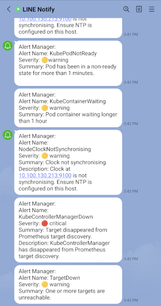

# LINE Notify Gateway

### _Node Express server for forwarding Prometheus AlertManager alerts_

Provides a Node docker image running the included Express server.

This server listens for requests from Prometheus Alert Manager, translates the request to be compliant with the [LINE Notify API](https://notify-bot.line.me/doc/en/) and forwards the request to the LINE Notify server.

## Getting Started

This server listens for HTTP requests on port **8080** and HTTPS requests on **8443**

#### TLS Configuration

If you want to use TLS then place your SSL certificate and **unencrypted** key in the ssl folder. They should be named `crt.pem` and `key.pem` respectively.

---

#### Running the server

You can run this project in several ways:

---

##### 1. Docker Image

```
docker build -t <ImageTag> .
docker run <ImageTag>
```

---

##### 2. Direct Install in Node Environment

1.  Run `npm install` to install packages
2.  Run `npm start` to start server

---

##### Sample Alert Configuration

```
webhook_configs:
  - url: <gateway_server_url>
    http_config:
      authorization:
        type: Bearer
        credentials_file: <path_to_credential_file>
```

---


