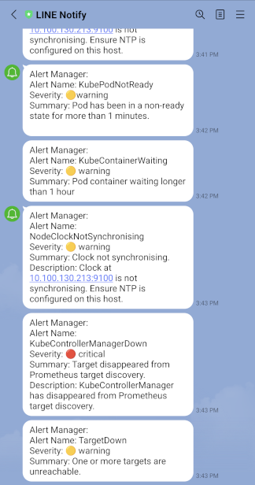

# LINE Notify Gateway

### _Node Express server for forwarding Prometheus AlertManager alerts_

Provides a Node docker image running the included Express server.

This server listens for requests from Prometheus Alert Manager, translates the request to be compliant with the [LINE Notify API](https://notify-bot.line.me/doc/en/) and forwards the request to the LINE Notify server.

## Getting Started

1. [Gateway Configuration](#gateway-configuration)
2. [Ports](#ports)
3. [TLS Configuration](#tls-configuration)
4. [Endpoints](#endpoints)
5. [Alertmanager Configuration](#alertmanager-configuration)
6. [Running the Server](#running-the-server)
7. [Adding colors for Severity Levels](#adding-colors-for-severity-levels)
8. [Tests](#tests)
9. [Contact Information](#contact-information)

---

## Gateway Configuration

Configure the LINE Gateway with the following environmental variables:

| ENV Variable Name            | Required/Optional | Type    | Description                                                                                                              |
| ---------------------------- | ----------------- | ------- | ------------------------------------------------------------------------------------------------------------------------ |
| REQUEST_URL                  | Required          | string  | URL to forward requests to                                                                                               |
| PROXY_URL                    | Optional          | string  | Proxy server address                                                                                                     |
| DEFAULT_LINE_TOKEN           | Optional          | string  | Default token that will be used if one is not specified in the [Alertmanager Configuration](#alertmanager-configuration) |
| ENABLE_TLS                   | Optional          | boolean | Enables HTTPS Server                                                                                                     |
| NODE_TLS_REJECT_UNAUTHORIZED | Optional          | integer | Disable TLS Reject Unauthorized (0 to disable)                                                                           |
| NODE_ENV                     | Optional          | String  | Set node Environment. Defaults to **development**, set to **production** for production environment                      |

---

## Ports

This server listens for HTTP requests on port **8080**.

If TLS is enabled the server listens for HTTPS requests on **8443**

---

## TLS Configuration

The server expects an SSL certificate named `crt.pem` and an **unencrypted** private key named `key.pem`. Place these two files in the `ssl` folder prior to building the docker image or running the server in a Node environment.

---

## Endpoints

#### POST /notify

Post alert requets to this endpoint

###### Method/Headers

| Request methods/headers | value               |
| ----------------------- | ------------------- |
| Method                  | POST                |
| authorization           | Bearer <LINE_token> |
| content-type            | application/json    |

###### Body Data Structures

${\textsf{\color{orange}Data}}$

| Name   | Type                | Description     |
| ------ | ------------------- | --------------- |
| status | string              | Status of alert |
| alerts | array &lt;Alert&gt; | array of Alerts |

${\textsf{\color{orange}Alert}}$

| Name        | Type            | Description       |
| ----------- | --------------- | ----------------- |
| labels      | Key-Value pairs | Alert labels      |
| annotations | Key-Value pairs | Alert Annotations |

For further details see [Alertmanager Documentation](https://prometheus.io/docs/alerting/latest/notifications/)

##### GET /health

###### Response

| Status Code | Type        | Description        |
| ----------- | ----------- | ------------------ |
| 200         | HealthCheck | Basic Health Check |

###### HealthCheck

| Name      | Type   | Notes                        |
| --------- | ------ | ---------------------------- |
| uptime    | string | Time server has been running |
| message   | string | Response message             |
| timestamp | string | Time of health check         |

##### GET /metrics

Prometheus metrics

---

## Alertmanager Configuration

The server expects a request from the Prometheus Alertmanager with LINE token specified in the header:

##### Sample Request Headers

```
{
  host: <host>,
  'user-agent': 'Alertmanager/0.26.0',
  'content-length': '894',
  authorization: 'Bearer <line_token>',
  'content-type': 'application/json'
}
```

A properly formatted request can be generated by the following Alertmanager receiver configuration:

##### Sample Alert Configuration

```
webhook_configs:
  - url: <gateway_server_url>/notify
    http_config:
      authorization:
        type: Bearer
        credentials_file: <path_to_credential_file>
```

With such a configuration the LINE token is stored in a credential file:

##### Sample Credential File

```
xjHyPpa8FukJU0EDJpRpP8dzT0G8uEPH13yJZbKnCMG
```

##### Mounting Credential File

In order not to be exposed, the credential file can be stored as a secret which the docker image can mount.

---

## Running the server

You can run this project in several ways:

##### 1. Docker Image

```
docker build -t <ImageTag> .
docker run <ImageTag>
```

###### Configuration

The docker file included in this project set up the server and uses [PM2 process manager](https://pm2.keymetrics.io/) to manage the process. A basic PM2 configuraiton is provided in `ecosystem.config.cjs`, please see [PM2 Docker Integration Documentation](https://pm2.keymetrics.io/docs/usage/docker-pm2-nodejs/) for more information.

If you want to specify environmental variables add them to your `docker run` command as needed. For example to specify a proxy:

```
docker run -e PROXY_URL=<proxy_url> <ImageTag>
```

Or to specify a request url:

```
docker run -e REQUEST_URL=<request_url> <ImageTag>
```

##### 2. Direct Install in Node Environment

1.  Run `npm install` to install packages
2.  Run `npm start` to start server

---

<a name="add-colors"></a>

## Adding colors for severity levels

Colors for severity levels are mapped in `src/utils/TextUtils.ts`

```
const SEVERITY_LOOKUP = new Map([
  ["none", "🔵"],
  ["warning", "🟡"],
  ["critical", "🔴"],
  ["default", "⚪"],
]);
```

For other severity levels, add another mapping:

```
const SEVERITY_LOOKUP = new Map([
  ["none", "🔵"],
  ["warning", "🟡"],
  ["critical", "🔴"],
  ["default", "⚪"],
  ["resolved", "🟢"]
]);
```

A similar map for Status icons is present in `src/utils/TextUtils.ts` as well and can be edited in the same fasion as Severity.

---

## Tests

This project includes a suite of tests located in the `src/tests` directory. You can run all tests by running

```
npm run test
```

You can also run individual tests with the following commands:
|Test|Command|
|---|---|
|MessageUtils| `npm run test-message-utils`|
|TextUtils| `npm run test-text-utils`|  
|NotifyController|`npm run test-notify-controller`|
|LineNotifyService|`npm run test-line-notify-service`|

---

## Contact Information

Please contact the author [Alex Holliday](mailto:ajhollid@gmail.com) if you have any questions or require assistance


